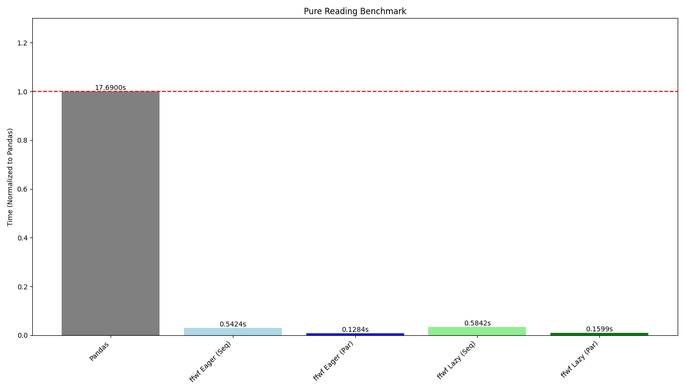
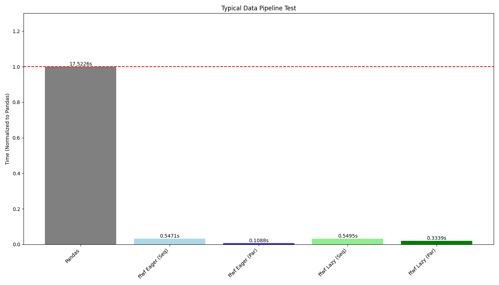
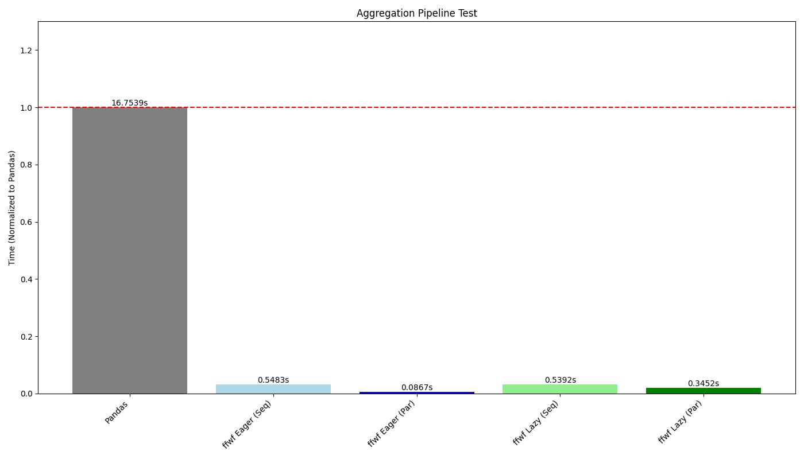
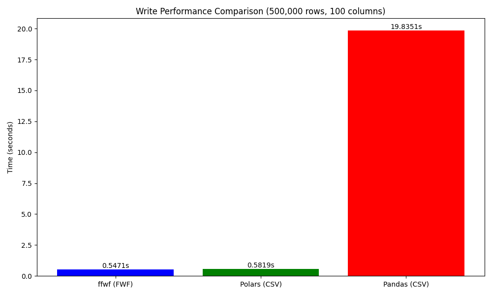

# ffwf (Fast Fwf)

`ffwf` provides a high-performance Fixed-Width File (FWF) parser and writer with a Rust core.

**🚀 Performance Focus**: `ffwf` is built for speed, achieving **~200x faster reading** and **~40x faster writing** compared to Pandas. It is Arrow-native and integrates seamlessly with Polars.

## Why Fixed-Width?

While formats like CSV are more common, Fixed-Width Files (FWF) provide a more robust **data contract** for high-integrity B2B exchanges:

- **Structural Integrity**: Unlike CSV, FWF is immune to "delimiter collision" and "quote hell." Comma, quotes, or newlines within a field cannot break the physical layout of the file.
- **Predictable Performance**: Because column positions are known at the byte level, parsers can slice data with near-zero overhead.
- **Consistency**: The fixed schema ensures that if a spec defines a column as 10 bytes, it remains 10 bytes. This prevents the "silent misalignment" often caused by poorly escaped CSVs.
- **Speed**: Parsing FWF files is faster than CSV due to the fixed schema and lack of delimiters.

`ffwf` brings the reliability of these legacy contracts into modern data ecosystems with native-speed parsing.

## Usage

The core package is **Arrow-native**. It returns zero-copy PyArrow Tables, making it compatible with any modern data tool.

### PyArrow (Core)

```python
import ffwf as fw

specs = [
    fw.FieldSpec("id", offset=0, length=5, dtype="int"),
    fw.FieldSpec("val", offset=5, length=10, dtype="float"),
    fw.FieldSpec("tag", offset=15, length=5, dtype="str"),
]

table = fw.read_fwf_arrow("data.fwf", specs)
```

### Integration (Pandas & Others)

`ffwf` does not provide built-in wrappers for Pandas or other dataframe libraries. To use `ffwf` with Pandas, simply convert the Arrow table:

```python
import ffwf as fw

specs = [...]
# 1. Parse to Arrow
table = fw.read_fwf_arrow("data.fwf", specs)

# 2. Convert to Pandas (zero-copy where possible)
df = table.to_pandas()
```

This pattern applies to any library supporting the Arrow interface (DuckDB, Daft, Ibis, etc.).

### Polars (Optional Integration)

Unlock the best performance and streaming capabilities. Polars functions are available directly from `ffwf` if `polars` is installed.

```python
import polars as pl
import ffwf as fw

# 1. Define field specifications
specs = [...]

# 2. Eager parsing (returns pl.DataFrame)
df = fw.read_fwf_pl("data.fwf", specs)

# 3. Lazy parsing (returns pl.LazyFrame)
lazy_df = fw.scan_fwf_pl("data.fwf", specs)
```

## Writing Fixed-Width Files

`ffwf` provides high-performance eager (`write_fwf_pl`, `write_fwf_arrow`) and streaming (`sink_fwf_pl`) writers.

**⚠️ Important**: Writing functions do **not** perform automatic validation. If a value exceeds the specified width, it will be **silently truncated**. You should manually call validation functions before writing if you need to ensure data integrity.

### Eager Writing (Polars/Arrow)

```python
# Write from Polars
fw.write_fwf_pl(df, "output.fwf", specs=specs)

# Write from Arrow
fw.write_fwf_arrow(table, "output.fwf", specs=specs)
```

### Streaming Writing (Polars)

For large datasets, use `sink_fwf_pl` to write data batch-by-batch without loading the entire frame into memory.

```python
# Streaming write
fw.sink_fwf_pl(lazy_df, "large_output.fwf", decimals=2)
```

### Writing Performance & Benchmarks

We compare `ffwf` write performance against **Polars CSV** and **Pandas CSV**. 

**Why compare against CSV?**
FWF is structurally simpler than CSV (no delimiters to escape, no complex quoting rules). Therefore, a high-performance FWF writer should theoretically match or exceed the speed of a CSV writer. We use Polars as the baseline because it represents the "speed of light" for data IO in the Python ecosystem.

| Method | Format | Time (500k rows) |
| :--- | :--- | :--- |
| **Pandas** | CSV | 24.21s |
| **Polars** | CSV | 0.60s |
| **ffwf** | **FWF** | **0.57s** |

*ffwf is **~40x faster** than Pandas and achieves parity with Polars' world-class CSV writer by using parallel formatting and vectorized Arrow processing.*

### Key Writing Features

- **Validation**: Strict width validation before writing. `sink_fwf_pl` reports the exact batch and row range on failure.
- **Float Rounding**: Floats are rounded to `decimals` to prevent width violations.
- **Boolean Treatment**: Customizable mapping for booleans (e.g., `bool_treatment=('Y', 'N', ' ')`).
- **Alignment**: Control string alignment with `pad_str_end`.

### Supported Data Types

Supported `fw.DType` members:
- **Integers**: `I8`, `I16`, `I32`, `I64`, `U8`, `U16`, `U32`, `U64`
- **Floats**: `F32`, `F64` (supports `NaN` and `inf`)
- **Strings**: `String`

## Full Reading Benchmarks

The following benchmarks compare `ffwf` against `pandas.read_fwf` (v2.2.3) using a synthetic dataset of **200,000 rows and 200 columns (~430MB)**.

| Method | Reading | Pipeline | Aggregation |
| :--- | :--- | :--- | :--- |
| **Pandas** | 16.06s | 16.16s | 16.79s |
| **ffwf (Seq)** | 0.51s | 0.51s | 0.51s |
| **ffwf (Par)** | **0.09s** | **0.08s** | **0.08s** |

*Benchmarks conducted on a 16-core machine. ffwf is **~170x faster** than Pandas for pure reading and **~200x faster** for filtered pipelines.*

### Visualization

#### Reading Benchmark


#### Pipeline Benchmark


#### Aggregation Benchmark


#### Write Comparison


## Building Locally

```bash
# Clone the repository
git clone <repo-url>
cd ffwf

# Create a virtual environment
uv venv
source .venv/bin/activate

# Install the package in editable mode with development dependencies
uv pip install -e ".[dev]"

# Build the Rust extension
RUSTFLAGS="-C target-cpu=native" maturin develop --release
```

## AI Assistance Disclosure

This project uses AI-assisted development with Gemini.
